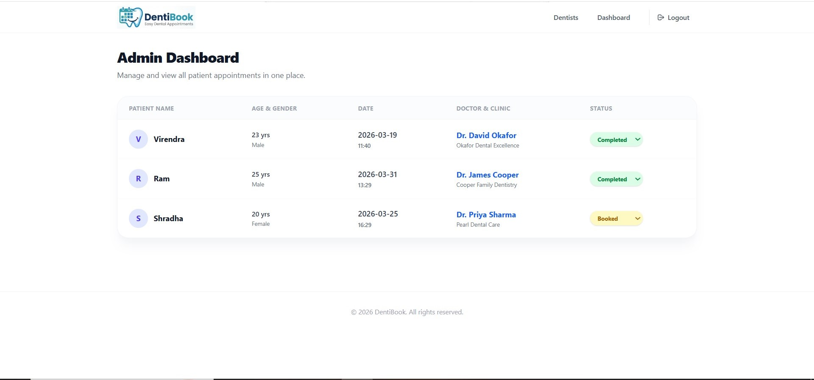
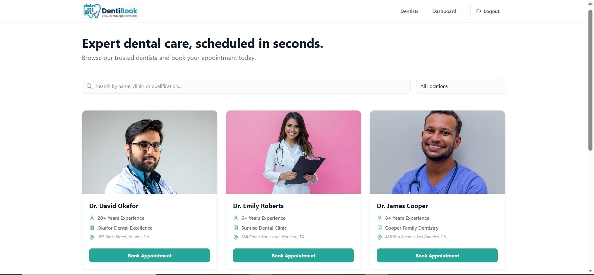

# DentiBook - Dentist Appointment Booking System

DentiBook is a modern, full-stack web application designed to streamline the process of booking dental appointments. It provides a user-friendly public interface for patients to discover dentists and book slots, alongside a secure, protected dashboard for clinic administrators to manage incoming appointments.

## 🖼️ Preview

| Admin Dashboard | Dentist View |
| :---: | :---: |
|  |  |

---


## 🚀 Tech Stack

### Frontend (Client)
*   **React (Vite):** Fast, modern UI development.
*   **Tailwind CSS:** Utility-first CSS framework for responsive, custom styling.
*   **React Router DOM:** Client-side routing for seamless navigation (Signup, Login, Dashboard).
*   **React Toastify:** Elegant, centralized notification system for user feedback.
*   **Axios:** Promise-based HTTP client with global interceptors for intercepting 401s and injecting auth tokens.

### Backend (Server)
*   **Node.js & Express:** Robust, asynchronous server infrastructure.
*   **MongoDB & Mongoose:** NoSQL database with strict schema validation and query building.
*   **JSON Web Tokens (JWT):** Stateless, secure token-based authentication.
*   **Bcrypt:** Cryptographic hashing for secure password storage.
*   **Helmet & Express Rate Limit:** Production-grade security middlewares for protecting HTTP headers and preventing brute-force attacks.
*   **Express Validator:** Middleware for sanitizing and validating incoming request payloads.

---

## 🏗️ Architecture & Explanation

The application follows a standard **Client-Server Architecture** utilizing a RESTful API, with the backend strictly adhering to the **MVC (Model-View-Controller)** design pattern.

1.  **MVC Backend Structure:**
    *   **Models:** Define the data structure and enforce strict validation rules before saving to MongoDB (`Admin.js`, `Dentist.js`, `Appointment.js`).
    *   **Controllers:** Isolate the core business logic (e.g., handling registration, verifying passwords, booking appointments, updating statuses).
    *   **Routes:** Map incoming HTTP requests to their specific controller functions.
    *   **Middleware:** Centralized logic that intercepts requests to handle JWT validation, format errors uniformly, and validate input payloads before they hit the controllers.

2.  **Authentication Flow:**
    *   The system uses **JWT (JSON Web Tokens)**. When an admin logs in successfully, the server responds with a signed token.
    *   The frontend stores this token in `localStorage`.
    *   For every subsequent request to a protected backend route (like viewing or modifying appointments), an Axios interceptor automatically attaches the token to the `Authorization: Bearer <token>` header.
    *   If the token expires or is invalid, the backend replies with a `401 Unauthorized`, which the frontend catches globally to automatically log the user out and redirect them to the login screen.

3.  **Frontend Routing Ecosystem:**
    *   Public routes (`/`, `/login`, `/signup`) are accessible to everyone.
    *   The `/dashboard` route is wrapped in a `<ProtectedRoute>` component that verifies the presence of an auth token before rendering the view.

---

## 🛠️ Setup Instructions

Follow these steps to get the project running locally.

### Prerequisites
*   [Node.js](https://nodejs.org/) (v16 or higher recommended)
*   [MongoDB](https://www.mongodb.com/try/download/community) (Local instance or MongoDB Atlas Cloud URI)

### 1. Clone the Repository
If you haven't already, clone or download the project to your local machine.

### 2. Backend Setup
1.  Navigate to the backend directory:
    ```bash
    cd backend
    ```
2.  Install dependencies:
    ```bash
    npm install
    ```
3.  Configure Environment Variables:
    Create a `.env` file in the `backend` directory with the following variables:
    ```env
    PORT=5000
    MONGODB_URI=mongodb://127.0.0.1:27017/dentist-appointment
    JWT_SECRET=your_super_secret_jwt_key_here
    NODE_ENV=development
    ```
    *(Replace `MONGODB_URI` with your Atlas connection string if you are using a cloud database).*
4.  (Optional) Seed the Database:
    To populate your database with some initial dentists and a default admin user (`admin` / `password123`), run:
    ```bash
    npm run seed
    ```
5.  Start the Server:
    ```bash
    npm run dev
    ```
    The backend should now be running on `http://localhost:5000`.

### 3. Frontend Setup
1.  Open a new terminal and navigate to the frontend directory:
    ```bash
    cd frontend
    ```
2.  Install dependencies:
    ```bash
    npm install
    ```
3.  Start the Development Server:
    ```bash
    npm run dev
    ```
4.  Access the Application:
    Open your browser and navigate to the URL provided by Vite (usually `http://localhost:5173`).

---

## 💡 Usage

*   **Patients:** Browse the landing page, search/filter for doctors, and click "Book Appointment" to schedule a visit.
*   **Admins:** Click "Sign Up" to create an administrative account, or "Admin Login" to access the dashboard.
*   **Dashboard:** Once logged in, admins can view all appointments, see patient demographics, and dynamically change the status of an appointment using the interactive dropdown.
